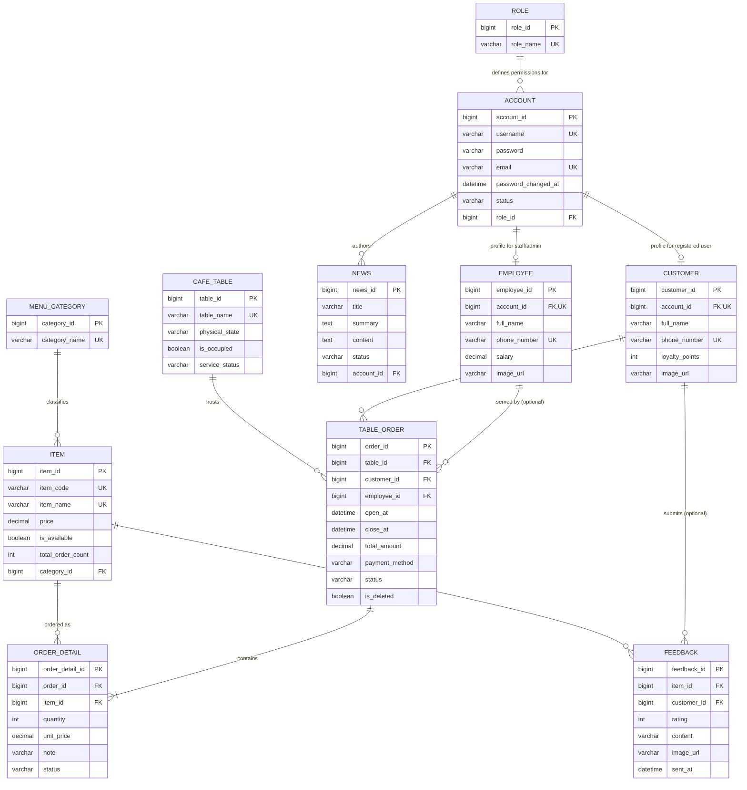
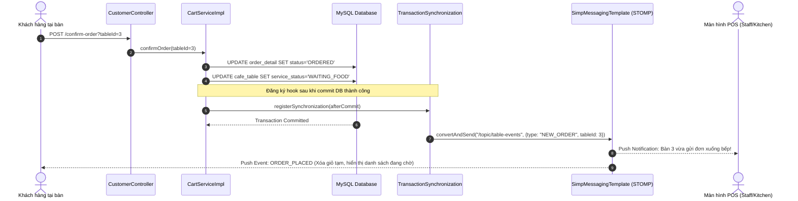
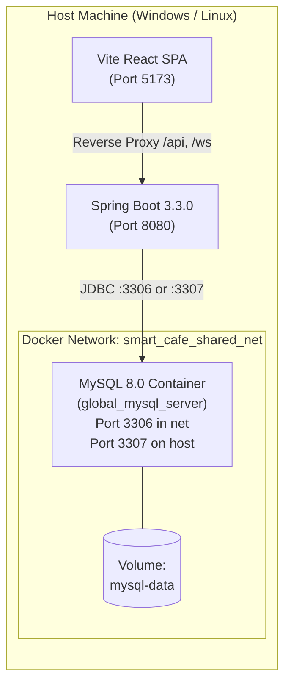

# TÀI LIỆU ĐẢO NGƯỢC KIẾN TRÚC & PHÂN TÍCH NGHIỆP VỤ HỆ THỐNG SMART CAFE MANAGEMENT

---

# 1. Executive Summary

**Smart Cafe Management** là hệ thống quản lý quán cà phê thông minh khép kín từ khâu đặt món tại bàn bằng mã QR (Dine-in QR Ordering), đồng bộ giỏ hàng thời gian thực đa thiết bị (Multi-device Cart Synchronization), điều phối pha chế tại quầy/bếp (Kitchen/Staff Operations), cho đến thanh toán (Tiền mặt, Chuyển khoản, PayPal Sandbox) và quản trị doanh thu, nhân sự, tin tức, phản hồi khách hàng (Admin Back-office).

Hệ thống được thiết kế theo mô hình kiến trúc **Client-Server tách rời (Decoupled Architecture) / Modular Monolith**:
* **Backend:** Phát triển trên nền tảng **Java 21**, **Spring Boot 3.3.0**, **Spring Data JPA (Hibernate 6)**, bảo mật với **Spring Security + JWT (JJWT 0.11.5)**, quản lý migration cơ sở dữ liệu với **Liquibase**, tích hợp cache và lưu trữ phiên tạm thời với **Redis (Upstash)**, truyền thông thời gian thực kép qua **WebSocket (STOMP / SockJS)** và **Server-Sent Events (SSE)**.
* **Frontend:** Phát triển bằng **React 19**, **Vite 8**, **TailwindCSS v4**, **Material UI**, quản lý routing bằng **React Router v7**, kết nối real-time qua `@stomp/stompjs` + `sockjs-client`, biểu đồ thống kê với `Recharts`, và tích hợp khung tư vấn khách hàng tự động bằng AI (Groq API).
* **Database & Hạ tầng:** Cơ sở dữ liệu quan hệ **MySQL 8.0** chạy trong Docker container (`global_mysql_server`), lưu trữ tài nguyên hình ảnh trên **Cloudinary**, xử lý thanh toán quốc tế qua **PayPal REST SDK**, gửi email xác thực và khôi phục mật khẩu qua **Google SMTP**.

### Đánh giá trọng tâm hệ thống
* **Điểm sáng kỹ thuật:** Kiến trúc đồng bộ bàn ăn thời gian thực rất mượt mà. Đơn hàng tạm được lưu trữ và cập nhật trạng thái liên tục; cơ chế bắn tín hiệu WebSocket được đồng bộ hóa với Database Transaction qua `TransactionSynchronizationManager.registerSynchronization` (`afterCommit`), ngăn ngừa triệt để lỗi "phantom notifications" (thông báo ảo khi DB rollback). Cơ chế bảo mật mật khẩu bắt buộc đổi định kỳ sau 30 ngày được kiểm tra ngay tại tầng JWT Filter (`JwtAuthFilter`).
* **Vấn đề cốt lõi cần giải quyết:** Tồn tại nhiều thông tin bảo mật nhạy cảm (Credentials, API Keys, App Passwords) đang bị hardcode trực tiếp trong `application.properties`; tầng dữ liệu xác thực thực hiện query DB trên mỗi HTTP request trong Filter; thiếu vắng hệ thống Unit/Integration test tự động; phụ thuộc unused `peerjs` chưa được dọn dẹp.

---

# 2. Project Overview

### 2.1. Problem Domain & Mục đích
Mô hình F&B truyền thống đối mặt với các vấn đề:
1. Quá tải giờ cao điểm: Khách hàng phải vẫy gọi phục vụ nhiều lần, phục vụ ghi nhầm món, sai sót ghi chú (ít đường, nhiều đá).
2. Trải nghiệm nhóm tại bàn kém: Khi nhiều khách ngồi cùng 1 bàn, việc chia sẻ danh sách món đang chọn rất khó khăn nếu không có công cụ đồng bộ.
3. Độ trễ giữa Order và Bếp: Nhân viên phải di chuyển giữa bàn và quầy pha chế để chuyển order giấy.
4. Thất thoát và chậm trễ thanh toán: Khách chờ đợi in bill, kiểm tra chéo mất thời gian.

**Smart Cafe Management giải quyết bài toán trên bằng cách:**
* Cung cấp menu điện tử theo từng bàn (`/menu/table/:tableId`). Mọi khách hàng ngồi cùng một bàn quét mã QR đều nhìn thấy giỏ hàng chung cập nhật theo thời gian thực (Real-time collaborative ordering).
* Nút gọi phục vụ và nút yêu cầu tính tiền thông báo tức thời (Zero-latency Push) đến màn hình POS của nhân viên (`/sale-manager`).
* Hỗ trợ thanh toán linh hoạt: Tiền mặt tại bàn hoặc Quét mã QR PayPal quốc tế.
* Trợ lý ảo AI (Chatbot tích hợp LLM) tư vấn món uống tự động cho khách hàng ngay trên giao diện web.

### 2.2. Đối tượng sử dụng (Actors)
1. **Khách hàng tại bàn (Guest / Customer):**
   * Quét mã QR bàn để vào menu.
   * Thêm/sửa/xóa món trong giỏ hàng tạm thời, chia sẻ giỏ hàng với bạn cùng bàn.
   * Gửi đơn xuống quầy bar/bếp.
   * Nhấn "Gọi nhân viên" hoặc "Yêu cầu thanh toán tiền mặt".
   * Quét mã PayPal để thanh toán trực tuyến.
   * Gửi đánh giá món ăn kèm ảnh chụp sau khi dùng bữa.
   * Chat với AI để nhận tư vấn đồ uống.
2. **Khách hàng có tài khoản (Registered User):**
   * Đăng nhập, tích lũy điểm thưởng (`loyaltyPoints`), xem lịch sử đơn hàng cá nhân, quản lý profile.
3. **Nhân viên phục vụ / Thu ngân (Staff):**
   * Quan sát trực quan sơ đồ trạng thái các bàn (Trống, Đang phục vụ, Chờ làm món, Gọi phục vụ, Chờ tính tiền).
   * Tiếp nhận đơn đặt món, chuyển trạng thái chế biến (`CONFIRMED`) và hoàn tất phục vụ (`SERVED`).
   * Hủy món khi hết nguyên liệu, hủy toàn bộ đơn bàn kèm lý do.
   * Duyệt thanh toán tiền mặt, tự động giải phóng bàn về trạng thái `EMPTY`.
   * Quản lý trạng thái còn/hết của món ăn (`isAvailable`).
   * Viết bài tin tức nội bộ/khuyến mãi (chờ Admin duyệt).
   * Xem và quản lý danh sách đánh giá của khách hàng.
4. **Quản trị viên (Admin):**
   * Toàn quyền của Staff.
   * Thêm, sửa, ngưng phục vụ, khôi phục thực đơn (`Item`, `MenuCategory`).
   * Quản lý nhân sự (`Employee`), tài khoản khách hàng (`Customer`).
   * Trực tiếp can thiệp chỉnh sửa số lượng món hoặc xóa món trong đơn hàng đang mở.
   * Duyệt hoặc từ chối bài viết tin tức (`NewsStatus.PUBLISHED / REJECTED`).
   * Xem Dashboard biểu đồ phân tích doanh thu theo ngày/tuần/tháng, cơ cấu món bán chạy.

---

# 3. Architecture

Hệ thống được xây dựng theo mô hình **Layered Architecture kết hợp Modular Monolith**:

```mermaid
flowchart TD
    subgraph Clients["Client Layer"]
        C_Guest["Khách hàng tại bàn (Mobile / QR Browser)"]
        C_Staff["Màn hình Nhân viên / Thu ngân (POS Web)"]
        C_Admin["Màn hình Quản trị viên (Admin Dashboard)"]
    end

    subgraph Gateway["Network & Routing Layer"]
        ViteDev["Vite Dev Server (Port 5173 / Reverse Proxy)"]
    end

    subgraph Presentation["Presentation & Security Layer (Spring Boot 3.3.0)"]
        Security["Spring Security + JwtAuthFilter"]
        REST["Spring MVC REST Controllers (/api/v1/*)"]
        WSEndpoint["STOMP Broker (/ws, /ws-news)"]
        SSEEndpoint["SSE Emitters (/api/v1/auth/notification/*)"]
    end

    subgraph Application["Business Logic / Service Layer"]
        AuthSvc["AuthService"]
        CartSvc["CartServiceImpl"]
        OrderSvc["OrderServiceImpl"]
        StaffOrderSvc["StaffOrderServiceImpl"]
        PaymentSvc["PaymentServiceImpl"]
        PayPalSvc["PayPalService"]
        ChatbotSvc["ChatbotService"]
        AdminItemSvc["AdminItemServiceImpl"]
        StatSvc["StatisticServiceImpl"]
        NewsSvc["NewsService"]
        FeedbackSvc["FeedbackServiceImpl"]
        UserSvc["UserService"]
    end

    subgraph Persistence["Persistence & Data Access Layer"]
        JPA["Spring Data JPA (Hibernate 6)"]
        Liquibase["Liquibase Migration Engine"]
    end

    subgraph DataStorage["Storage & Cache"]
        MySQL[("MySQL 8.0 Database (Docker Container: 3307/3306)")]
        Redis[("Upstash Redis (TTL Caching & OTP Sessions)")]
    end

    subgraph External["External Cloud Services"]
        Cloudinary["Cloudinary API (Image Storage)"]
        PayPalAPI["PayPal REST API (Sandbox)"]
        GroqAI["Groq AI API (Qwen/LLaMA LLM)"]
        GmailSMTP["Gmail SMTP Server (OTP Mailer)"]
        QRServer["api.qrserver.com (Dynamic QR Generator)"]
    end

    %% Client connection
    C_Guest -->|HTTP / REST| ViteDev
    C_Guest -->|WebSocket STOMP| ViteDev
    C_Staff -->|HTTP / REST| ViteDev
    C_Staff -->|WebSocket STOMP| ViteDev
    C_Admin -->|HTTP / REST| ViteDev

    %% Proxying
    ViteDev -->|Proxy /api| REST
    ViteDev -->|Proxy /ws, /ws-news| WSEndpoint

    %% Security
    REST --> Security
    Security --> REST

    %% Controller to Service
    REST --> AuthSvc
    REST --> CartSvc
    REST --> OrderSvc
    REST --> StaffOrderSvc
    REST --> PaymentSvc
    REST --> ChatbotSvc
    REST --> AdminItemSvc
    REST --> StatSvc
    REST --> NewsSvc
    REST --> FeedbackSvc
    REST --> UserSvc
    REST --> SSEEndpoint

    %% Service to External
    AuthSvc -->|Send OTP| GmailSMTP
    AuthSvc -->|Save/Verify OTP| Redis
    PaymentSvc --> PayPalSvc
    PayPalSvc --> PayPalAPI
    PayPalSvc --> QRServer
    ChatbotSvc --> GroqAI
    AdminItemSvc --> Cloudinary
    NewsSvc --> Cloudinary
    FeedbackSvc --> Cloudinary
    UserSvc --> Cloudinary

    %% Service to Data
    CartSvc --> JPA
    OrderSvc --> JPA
    StaffOrderSvc --> JPA
    PaymentSvc --> JPA
    StatSvc --> JPA
    NewsSvc --> JPA
    FeedbackSvc --> JPA
    UserSvc --> JPA

    JPA --> MySQL
    Liquibase --> MySQL

    %% Real-time Sync
    CartSvc -.->|Push Cart Update| WSEndpoint
    OrderSvc -.->|Push Table Event| WSEndpoint
    StaffOrderSvc -.->|Push After Commit| WSEndpoint
    PaymentSvc -.->|Push Clear Table| WSEndpoint
    NewsSvc -.->|Push News Event| WSEndpoint
    FeedbackSvc -.->|Push Feedback Event| WSEndpoint

    WSEndpoint -.->|Broadcast| C_Guest
    WSEndpoint -.->|Broadcast| C_Staff
    WSEndpoint -.->|Broadcast| C_Admin
```



---

# 4. Project Structure

### Bảng kiểm kê tổng thể (Project Inventory)

| Path | Type | Responsibility | Dependency | Importance |
| :--- | :--- | :--- | :--- | :--- |
| `backend/` | Maven Module | Chứa toàn bộ mã nguồn Backend Java Spring Boot | Spring Boot 3.3.0, Java 21 | **CRITICAL** |
| `backend/src/main/java/.../config/` | Package | Cấu hình Cloudinary, PayPal, OpenAPI, WebSocket STOMP | Spring Context, Cloudinary, PayPal SDK | HIGH |
| `backend/src/main/java/.../controller/` | Package | Định nghĩa 16 REST Controllers tiếp nhận request HTTP | Spring Web, Spring Security, Services | **CRITICAL** |
| `backend/src/main/java/.../dto/` | Package | Các đối tượng Data Transfer Object (Request/Response) | Lombok, Jakarta Validation | HIGH |
| `backend/src/main/java/.../entity/` | Package | Định nghĩa 12 thực thể JPA tương ứng với các bảng trong DB | Jakarta Persistence, Hibernate | **CRITICAL** |
| `backend/src/main/java/.../enums/` | Package | 8 Enums định nghĩa trạng thái bàn, đơn, món, tài khoản, v.v. | Java Native | **CRITICAL** |
| `backend/src/main/java/.../exception/` | Package | Global Exception Handler & AppException tùy biến | Spring Web, Jakarta Servlet | HIGH |
| `backend/src/main/java/.../repository/` | Package | Spring Data JPA Repositories (truy vấn DB, custom JPQL) | Spring Data JPA, Entities | **CRITICAL** |
| `backend/src/main/java/.../security/` | Package | Cấu hình Security, JwtAuthFilter, JwtTokenProvider | JJWT, Spring Security | **CRITICAL** |
| `backend/src/main/java/.../service/` | Package | Xử lý toàn bộ logic nghiệp vụ (Core Business Logic) | Repositories, Redis, External APIs | **CRITICAL** |
| `backend/src/main/resources/application.properties` | Config | Cấu hình kết nối DB, Redis, Mail, Cloudinary, PayPal, Groq | Spring Boot | **CRITICAL** |
| `backend/src/main/resources/db/changelog/` | Liquibase | Quản lý schema migration và nạp dữ liệu khởi tạo | Liquibase Engine, YAML/SQL | HIGH |
| `frontend/` | Node Module | Toàn bộ ứng dụng Single Page Application (SPA) React | React 19, Vite 8, Tailwind v4 | **CRITICAL** |
| `frontend/src/pages/` | Directory | 14 thư mục trang chức năng (Menu, Sale, Admin, Auth, v.v.) | React, React Router, Services | **CRITICAL** |
| `frontend/src/components/` | Directory | Các UI components dùng chung (Modal, Lightbox, AI Chat, v.v.) | React, MUI, Lucide Icons | HIGH |
| `frontend/src/services/` | Directory | `apiService.js`, `socketService.js`, `toastService.js` | Axios, StompJS, SockJS | **CRITICAL** |
| `frontend/src/routes/AppRoutes.jsx` | File | Quản lý routing và phân quyền theo Role (`RequireRole`) | React Router DOM | HIGH |
| `frontend/src/validation/` | Directory | Yup validation schemas cho Formik (Item, News, Profile) | Yup | MEDIUM |
| `Docker/docker-compose.yml` | Container | Khởi tạo MySQL 8.0 container trên port 3307 | Docker Engine | HIGH |
| `smart_cafe_management.sql` | SQL Script | Bản dump cơ sở dữ liệu mẫu độc lập | MySQL | MEDIUM |

### Phân loại module & Kiến trúc thực tế
* **Core Modules:** Quản lý bàn & Giỏ hàng cộng tác (`CartService`, `TablesRepository`), Xử lý đơn hàng pha chế (`StaffOrderService`, `OrderService`), Thanh toán (`PaymentService`, `PayPalService`), Xác thực người dùng (`AuthService`, `JwtAuthFilter`).
* **Supporting Modules:** Quản trị thực đơn (`AdminItemService`), Quản trị nhân sự/khách hàng (`EmployeeService`, `CustomerService`), Tin tức (`NewsService`), Đánh giá (`FeedbackService`), Thống kê (`StatisticService`), AI Chatbot (`ChatbotService`).
* **Quan hệ phụ thuộc:** Tầng Controller phụ thuộc trực tiếp vào Service; Service phụ thuộc vào Repository và External SDKs; Không xảy ra circular dependency nhờ việc phân tách rõ ràng giữa Service Interface và Implementation.
* **Kiến trúc thực tế:** Đây là một **Layered Monolith (Kiến trúc phân tầng Controller-Service-Repository)** kết hợp với mô hình Event-driven real-time qua WebSockets STOMP.

---

# 5. Core Modules

### 5.1. Module Giỏ hàng tạm & Đặt món cộng tác (`CartService` / `CustomerController`)
* **Purpose:** Phục vụ khách hàng tại bàn quét QR, cùng thêm món, sửa ghi chú và gửi đơn xuống bếp.
* **Responsibility:** Quản lý vòng đời giỏ hàng tạm (trạng thái `PENDING`), tạo mới `TableOrder` nếu bàn chưa mở, gộp món, chuyển đổi giỏ hàng thành đơn chính thức (`ORDERED`).
* **Input:** `tableId`, `itemId`, `quantity`, `note`.
* **Processing:**
  * Kiểm tra bàn có đang trong tiến trình yêu cầu thanh toán (`REQUESTING_BILL` hoặc `WAITING_PAYMENT`) không; nếu có thì chặn thay đổi.
  * Tìm đơn hàng đang `OPEN` của bàn. Nếu chưa có, tự động kích hoạt bàn (`isOccupied = true`) và tạo mới một `TableOrder` (`status = OPEN`, `totalAmount = 0`).
  * Tìm bản ghi `OrderDetail` đang có `status = PENDING` của món đó: Nếu có, cộng dồn `quantity` và ghép chuỗi ghi chú; nếu chưa, tạo mới `OrderDetail` trạng thái `PENDING`.
  * Khi khách bấm chốt đơn (`confirmOrder`): Duyệt toàn bộ món `PENDING` -> chuyển sang `ORDERED`, tăng bộ đếm lượt gọi của món (`item.totalOrderCount += quantity`), cộng dồn tổng tiền `order.totalAmount`, cập nhật bàn sang `ServiceStatus.WAITING_FOOD`.
* **Output:** `CartResponseDTO` gồm danh sách `pendingItems`, `orderedItems` và `currentTotalAmount`.
* **Side Effects:** Mutation vào các bảng `cafe_table`, `table_order`, `order_detail`, `item`. Phát socket tới `/topic/tables/{tableId}` và `/topic/table-events`.

### 5.2. Module Điều phối Bàn & Bếp POS (`StaffOrderService` / `StaffController`)
* **Purpose:** Cung cấp giao diện làm việc trung tâm cho nhân viên phục vụ, bar/bếp và thu ngân.
* **Responsibility:** Hiển thị sơ đồ bàn trực quan, xác nhận đơn hàng loạt, chuyển trạng thái phục vụ từng món lẻ hoặc cả bàn, hủy món, hủy bàn.
* **Input:** `tableId`, `tableOrderId`, `orderDetailId`, `reason`.
* **Processing:**
  * Chuyển trạng thái món theo chuỗi: `ORDERED` -> `CONFIRMED` -> `SERVED`.
  * Hủy món lẻ (`cancelOrderItem`): Chuyển trạng thái món thành `CANCELLED`, ghi lý do vào `note`, trừ ngược `item.totalOrderCount`, tính toán lại tổng tiền `order.totalAmount` (chỉ tính các món không bị CANCELLED).
  * Hủy toàn bộ đơn bàn (`cancelTableOrder`): Chuyển `order.status = CANCELLED`, tất cả món thành `CANCELLED`, giải phóng bàn về `EMPTY`, `isOccupied = false`.
* **Output:** `ActiveOrderDTO`, `OrderDetailResponseDTO`, danh sách `Tables`.
* **Side Effects:** Thay đổi DB, đồng bộ WebSocket thông qua `TransactionSynchronizationManager.afterCommit()`.

### 5.3. Module Thanh toán & Hóa đơn (`PaymentService`, `PayPalService` / `PaymentController`)
* **Purpose:** Thực hiện quy trình chốt hóa đơn, hỗ trợ thu tiền mặt tại chỗ hoặc thanh toán số qua cổng PayPal.
* **Responsibility:** Khóa giỏ hàng, chuyển trạng thái đơn sang `WAITING_PAYMENT`, tính toán quy đổi ngoại tệ VND -> USD, tích hợp PayPal API Context, hoàn tất thanh toán `PAID` và giải phóng bàn.
* **Input:** `tableId`, `paymentMethod`, `paymentId`, `PayerID`.
* **Processing:**
  * Yêu cầu thanh toán (`requestCheckout`): Kiểm tra đơn có món hợp lệ không (loại bỏ CANCELLED). Đổi đơn sang `WAITING_PAYMENT`, đổi bàn sang `REQUESTING_BILL`.
  * PayPal: Tính `totalAmount / 25000` (làm tròn 2 chữ số thập phân), gọi PayPal SDK tạo phiên thanh toán dạng `sale`, sinh URL chuyển hướng và QR code. Khi PayPal callback thành công, backend thực thi `executePayment`, chốt đơn sang `PAID`, set `paidAt = now()`, tự động chuyển các món chưa mang ra thành `SERVED`, trả bàn về `EMPTY`.
* **Side Effects:** Gọi API bên thứ 3 (PayPal REST), cập nhật DB, bắn WebSocket dọn bàn (`TABLE_CLEARED`).

### 5.4. Module Xác thực & Tài khoản (`AuthService`, `UserService` / `AuthController`, `UserController`)
* **Purpose:** Cung cấp cổng bảo mật truy cập hệ thống theo mô hình Stateless JWT và chu trình khôi phục mật khẩu OTP an toàn.
* **Responsibility:** Xác thực đăng nhập, kiểm tra hạn mật khẩu 30 ngày, sinh mã OTP 6 số lưu Redis với TTL 5 phút, xác thực OTP đổi lấy Reset Token UUID (TTL 5 phút), cập nhật mật khẩu mã hóa BCrypt.
* **Side Effects:** Đọc/ghi Redis, gửi email SMTP qua Gmail, sinh JWT.

---

# 6. Business Domain

### 6.1. Domain Entities & Bounded Contexts
1. **Quản lý Tài nguyên Quán (Catalog Context):**
   * `Item`: Món ăn, đồ uống trong thực đơn (mã món, tên, đơn giá, ảnh, trạng thái còn/hết, số lượt gọi).
   * `MenuCategory`: Danh mục thực đơn (Cà phê truyền thống, Trà trái cây, Bánh ngọt...).
   * `Tables` (`cafe_table`): Bàn trong quán (tên bàn, tình trạng vật lý `physical_state`, trạng thái phục vụ `service_status`, cờ có khách `is_occupied`).
2. **Bán hàng & Phục vụ (Ordering Context):**
   * `TableOrder`: Hóa đơn/Lượt phục vụ của một bàn (gắn với bàn, khách hàng, nhân viên, giờ mở/đóng, tổng tiền, phương thức thanh toán, trạng thái đơn).
   * `OrderDetail`: Chi tiết từng món trong đơn (gắn với món, số lượng, đơn giá tại thời điểm gọi, ghi chú tùy chỉnh, trạng thái món).
3. **Người dùng & Phân quyền (Identity Context):**
   * `Account`: Tài khoản hệ thống (username, password BCrypt, email, ngày đổi pass gần nhất, trạng thái hoạt động, khóa ngoại liên kết `Role`).
   * `Role`: Vai trò hệ thống (`ADMIN`, `STAFF`, `USER`).
   * `Employee`: Hồ sơ nhân viên (họ tên, ngày sinh, giới tính, sđt, địa chỉ, mức lương, avatar).
   * `Customer`: Hồ sơ khách hàng (họ tên, sđt, địa chỉ, điểm tích lũy `loyaltyPoints`, avatar).
4. **Tương tác & Truyền thông (Engagement Context):**
   * `Feedback`: Đánh giá món ăn của khách hàng (gắn bắt buộc với `Item`, tùy chọn gắn với `Customer`, số sao 1-5, nội dung, ảnh chụp).
   * `News`: Bảng tin, khuyến mãi (tiêu đề, tóm tắt, nội dung HTML, tác giả `Account`, trạng thái duyệt `NewsStatus`).

---

# 7. Business Rules

Toàn bộ các quy tắc nghiệp vụ (Business Rules) được trích xuất trực tiếp từ mã nguồn:

| STT | Quy tắc nghiệp vụ (Rule) | Điều kiện kiểm tra (Condition) | Hành động thực thi (Action) | Vị trí Source Code chứng minh |
| :--- | :--- | :--- | :--- | :--- |
| **BR-01** | Bắt buộc đổi mật khẩu sau 30 ngày | `account.passwordChangedAt == null` HOẶC `now - passwordChangedAt > 30 ngày` | Gắn claim `requirePasswordChange = true` vào JWT; `JwtAuthFilter` chặn mọi request (trả về HTTP 403) ngoại trừ `/change-password` và `/logout` | `AuthService.java:65-68`, `JwtAuthFilter.java:57-67` |
| **BR-02** | Khóa giỏ hàng khi đang thanh toán | `table.serviceStatus == REQUESTING_BILL` HOẶC tồn tại đơn `status == WAITING_PAYMENT` | Chặn mọi hành động thêm/sửa/xóa/confirm giỏ hàng, ném `RuntimeException("Bàn đang chờ thanh toán...")` | `CartServiceImpl.java:219-231` |
| **BR-03** | Tự động mở bàn khi thêm món đầu tiên | Bàn chưa có đơn hàng nào ở trạng thái `OPEN` | Tạo `TableOrder` mới (`status = OPEN`), cập nhật `table.isOccupied = true` | `CartServiceImpl.java:42-54` |
| **BR-04** | Cộng dồn món và ghi chú trong giỏ | Món đã tồn tại trong giỏ với trạng thái `PENDING` | Cộng thêm `quantity`; ghép chuỗi ghi chú cũ và mới: `oldNote + ", " + newNote` | `CartServiceImpl.java:61-73` |
| **BR-05** | Giới hạn quyền hủy món của khách | Khách yêu cầu hủy món có `status != StatusOrderDetail.ORDERED` | Ném `RuntimeException("Không thể hủy món do Bếp đã nhận chế biến hoặc đã phục vụ!")` | `OrderServiceImpl.java:103-105` |
| **BR-06** | Hoàn trả lượt bán và trừ tiền khi hủy món | Món bị hủy bởi khách hoặc nhân viên | Giảm `item.totalOrderCount`, trừ số tiền món khỏi `order.totalAmount`, chuyển trạng thái món sang `CANCELLED` | `OrderServiceImpl.java:123-138`, `StaffOrderServiceImpl.java:296-300` |
| **BR-07** | Chỉ Admin mới được can thiệp sửa/xóa món trên đơn đang mở | Endpoint sửa số lượng / xóa món trên đơn bàn | Yêu cầu quyền `@PreAuthorize("hasRole('ADMIN')")`; Staff không thể sửa | `StaffController.java:161-182` |
| **BR-08** | Khách gọi phục vụ khi đang chờ hóa đơn | `table.serviceStatus` đang là `REQUESTING_BILL` và nhận sự kiện `CALL_STAFF` | Giữ nguyên trạng thái `REQUESTING_BILL` trong DB để giữ nút thanh toán trên POS, chỉ phát WebSocket báo chuông nhân viên | `OrderServiceImpl.java:62-74` |
| **BR-09** | Tự động hoàn tất chế biến khi thanh toán | Đơn hàng chuyển sang `PAID` mà vẫn còn món đang `ORDERED` hoặc `CONFIRMED` | Hệ thống tự động chuyển tất cả các món còn lại sang `SERVED` | `PaymentServiceImpl.java:98-103` |
| **BR-10** | Điều kiện đánh giá món ăn (Feedback) | Khách gửi đánh giá kèm `orderId` và `itemId` | Kiểm tra bắt buộc món phải nằm trong hóa đơn (`existsByOrderTableOrderIdAndItemItemId`); khách vãng lai bắt buộc nhập email | `FeedbackServiceImpl.java:46-54`, `FeedbackController.java:64-67` |
| **BR-11** | Phân cấp xuất bản tin tức | Nhân viên (`STAFF`) tạo bài viết mới hoặc sửa bài viết đang `PUBLISHED` | Tin tức tự động chuyển về `NewsStatus.PENDING` (chờ Admin duyệt), gỡ bài khỏi trang chủ khách hàng | `NewsService.java:110, 145-149` |
| **BR-12** | Chống rò rỉ tài khoản khi Quên mật khẩu | Người dùng yêu cầu OTP qua email | Luôn trả về thông báo trung tính giống nhau bất kể email có tồn tại trong hệ thống hay không | `AuthService.java:75-80` |
| **BR-13** | Cơ chế OTP 2 giai đoạn an toàn | Người dùng xác thực OTP thành công | Xóa OTP trong Redis, cấp một UUID `resetTokenUuid` mới có hiệu lực 5 phút để gọi bước reset password | `AuthService.java:99-112` |
| **BR-14** | Vòng đời xóa món ăn (Item Lifecycle) | Admin xóa món ăn trong danh mục | Không xóa vật lý, chỉ gán cờ `isAvailable = false`; hỗ trợ endpoint phục hồi `restoreItem` | `AdminItemServiceImpl.java:162-176` |

---

# 8. Main Business Flows

### 8.1. Luồng Gọi món tại bàn & Đồng bộ đa thiết bị (Order Flow)

```text
Khách hàng A (Điện thoại 1)            Backend (Spring Boot)                 Khách hàng B (Điện thoại 2 cùng bàn) & Bếp
    │                                          │                                          │
    ├─ POST /api/v1/customer/cart/add ────────>│                                          │
    │  (tableId=3, itemId=1, qty=1)            ├─ Lưu OrderDetail (Status: PENDING)       │
    │                                          ├─ Bắn WebSocket /topic/tables/3 ─────────>│ Cập nhật giỏ hàng tức thì
    │                                          │  (type: CART_UPDATED)                    │
    ├─ POST /api/v1/customer/confirm-order ───>│                                          │
    │  (tableId=3)                             ├─ Chuyển PENDING -> ORDERED               │
    │                                          ├─ Cộng totalOrderCount cho Item           │
    │                                          ├─ Bàn đổi serviceStatus = WAITING_FOOD    │
    │                                          ├─ Commit DB Transaction                   │
    │                                          ├─ Bắn WS /topic/table-events ────────────>│ Màn hình Bếp/Staff: Rung chuông đơn mới
    │                                          ├─ Bắn WS /topic/tables/3 ────────────────>│ Cả 2 điện thoại: Giỏ về rỗng, báo "Đã gửi đơn"
    │<─ HTTP 200 OK ───────────────────────────┤                                          │
```

### 8.2. Luồng Xử lý Pha chế & Phục vụ (Kitchen & Staff Flow)

```text
Nhân viên / Bếp (POS)                  Backend (Spring Boot)                 Khách hàng tại bàn
    │                                          │                                          │
    ├─ PUT /api/v1/staff/tables/3/confirm-all─>│                                          │
    │                                          ├─ Chuyển món ORDERED -> CONFIRMED         │
    │                                          ├─ Commit DB                               │
    │                                          ├─ Bắn WS /topic/tables/3/orders ─────────>│ Màn hình khách: "Đơn hàng đã được tiếp nhận"
    │                                          │  (type: ORDER_CONFIRMED)                 │
    ├─ PUT /api/v1/staff/tables/3/serve-all ──>│                                          │
    │                                          ├─ Chuyển món CONFIRMED -> SERVED          │
    │                                          ├─ Bàn đổi serviceStatus = SERVING         │
    │                                          ├─ Commit DB                               │
    │                                          ├─ Bắn WS /topic/tables/3/orders ─────────>│ Màn hình khách: "Tất cả món đã phục vụ"
    │<─ HTTP 200 OK ───────────────────────────┤                                          │
```

### 8.3. Luồng Thanh toán PayPal Sandbox (PayPal Checkout Flow)

```text
Khách hàng tại bàn                     Backend (Spring Boot)                 PayPal Sandbox API
    │                                          │                                          │
    ├─ POST /customer/payment/paypal?tableId=3>│                                          │
    │                                          ├─ Lấy tổng tiền VND                       │
    │                                          ├─ Quy đổi USD (rate = 25,000)             │
    │                                          ├─ Gọi tạo payment ───────────────────────>│
    │                                          │<─ Trả về approval_url ───────────────────┤
    │                                          ├─ Tạo URL QR code động                    │
    │<─ Trả về approvalUrl & qrCodeUrl ────────┤                                          │
    │                                          │                                          │
    ├─ Quét mã / Truy cập approvalUrl ─────────┼─────────────────────────────────────────>│ Khách login PayPal & bấm Pay
    │                                          │                                          │
    │                                          │<─ Redirect GET /paypal/success ──────────┤
    │                                          │   (?paymentId=...&PayerID=...&tableId=3) │
    │                                          ├─ Gọi executePayment ────────────────────>│
    │                                          │<─ Xác nhận state = "approved" ───────────┤
    │                                          ├─ Chuyển Order -> PAID                    │
    │                                          ├─ Chuyển món chưa xong -> SERVED          │
    │                                          ├─ Đổi bàn -> EMPTY (isOccupied = false)   │
    │                                          ├─ Bắn WS /topic/staff-requests (Checkout) │
    │<─ Redirect về Frontend /payment-success ─┤                                          │
```

### 8.4. Luồng Quên mật khẩu & Đổi mật khẩu 2 bước (OTP Flow)

```text
Người dùng                            Backend (Spring Boot)                 Upstash Redis         Gmail SMTP
    │                                          │                                  │                   │
    ├─ POST /auth/forgot-password ────────────>│                                  │                   │
    │  (email: user@gmail.com)                 ├─ Kiểm tra tài khoản ACTIVE       │                   │
    │                                          ├─ Sinh OTP 6 số (SecureRandom)    │                   │
    │                                          ├─ SET OTP_VAL:123456 (TTL: 5m) ──>│                   │
    │                                          ├─ Gửi mail HTML qua template ─────┼──────────────────>│ Gửi tới người dùng
    │<─ HTTP 200 "Nếu email hợp lệ..." ────────┤                                  │                   │
    │                                          │                                  │                   │
    ├─ POST /auth/verify-otp (token: "123456")>│                                  │                   │
    │                                          ├─ GET OTP_VAL:123456 ────────────>│                   │
    │                                          │<─ Trả về email ──────────────────┤                   │
    │                                          ├─ Sinh UUID Token mới             │                   │
    │                                          ├─ SET RESET_UUID:uuid (TTL: 5m) ─>│                   │
    │                                          ├─ DEL OTP_VAL:123456 ────────────>│                   │
    │<─ HTTP 200 { "resetToken": uuid } ───────┤                                  │                   │
    │                                          │                                  │                   │
    ├─ POST /auth/reset-password ─────────────>│                                  │                   │
    │  (token: uuid, newPassword: "...")       ├─ GET RESET_UUID:uuid ───────────>│                   │
    │                                          │<─ Trả về email ──────────────────┤                   │
    │                                          ├─ Mã hóa BCrypt mật khẩu mới      │                   │
    │                                          ├─ Lưu DB (passwordChangedAt = now)│                   │
    │                                          ├─ DEL RESET_UUID:uuid ───────────>│                   │
    │<─ HTTP 200 "Đặt lại mật khẩu thành công"─┤                                  │                   │
```

---

# 9. API

Dưới đây là bảng tổng hợp toàn bộ 34 REST Endpoints chính thức của hệ thống:

| Method | Endpoint | Auth / Role | Request Body / Params | Response | Business Logic | DB Access | External Service |
| :--- | :--- | :--- | :--- | :--- | :--- | :--- | :--- |
| `POST` | `/api/v1/auth/login` | PermitAll | `LoginRequest` (username, password) | `LoginResponse` (token, role, needChangePass) | Xác thực BCrypt, kiểm tra hạn pass 30 ngày, sinh JWT | `account` | Không |
| `POST` | `/api/v1/auth/forgot-password` | PermitAll | `ForgotPasswordRequest` (email) | Message String | Sinh OTP 6 số, gửi mail, lưu Redis 5m | `account` | Redis, Gmail SMTP |
| `POST` | `/api/v1/auth/verify-otp` | PermitAll | `VerityOtpRequest` (token) | `{ resetToken: UUID }` | Kiểm tra OTP, sinh UUID thay thế lưu Redis 5m | Không | Redis |
| `POST` | `/api/v1/auth/reset-password` | PermitAll | `ResetPasswordRequest` (token, newPassword) | Message String | Lấy email từ UUID, mã hóa BCrypt, cập nhật pass | `account` | Redis |
| `GET` | `/api/v1/customer/cart/{tableId}` | PermitAll | Path: `tableId` | `CartResponseDTO` | Lấy chi tiết món pending & ordered của bàn | `table_order`, `order_detail` | Không |
| `POST` | `/api/v1/customer/cart/add` | PermitAll | `CartItemRequestDTO` | Message String | Thêm món giỏ tạm, tự mở bàn nếu chưa có đơn | `cafe_table`, `table_order`, `order_detail` | WebSocket |
| `PUT` | `/api/v1/customer/cart/items/{itemId}` | PermitAll | Path: `itemId`, Query: `tableId`, `quantity`, `note` | Message String | Cập nhật số lượng/ghi chú giỏ tạm; xóa nếu qty <= 0 | `order_detail` | WebSocket |
| `DELETE` | `/api/v1/customer/cart/items/{itemId}` | PermitAll | Path: `itemId`, Query: `tableId` | Message String | Xóa 1 món khỏi giỏ hàng tạm | `order_detail` | WebSocket |
| `DELETE` | `/api/v1/customer/cart/clear` | PermitAll | Query: `tableId` | Message String | Xóa sạch toàn bộ món PENDING của bàn | `order_detail` | WebSocket |
| `POST` | `/api/v1/customer/confirm-order` | PermitAll | Query: `tableId` | Message String | Chốt đơn: chuyển PENDING -> ORDERED, tăng tổng tiền | `cafe_table`, `table_order`, `order_detail`, `item` | WebSocket |
| `POST` | `/api/v1/customer/call-service` | PermitAll | Query: `tableId` | Message String | Đổi `serviceStatus = CALL_STAFF`, bắn tín hiệu gọi | `cafe_table` | WebSocket |
| `POST` | `/api/v1/customer/payment/cash` | PermitAll | Query: `tableId` | Message String | Yêu cầu tính tiền mặt, đổi `REQUESTING_BILL` | `cafe_table`, `table_order` | WebSocket |
| `POST` | `/api/v1/customer/payment/paypal` | PermitAll | Query: `tableId` | `{ approvalUrl, qrCodeUrl }` | Tính tiền USD, tạo đơn PayPal sandbox, tạo QR | `table_order`, `order_detail` | PayPal SDK, QRServer |
| `GET` | `/api/v1/customer/payment/paypal/success` | PermitAll | Query: `paymentId`, `PayerID`, `tableId` | RedirectView | Thực thi thanh toán PayPal, chốt đơn PAID, giải phóng bàn | `cafe_table`, `table_order`, `order_detail` | PayPal SDK, WebSocket |
| `GET` | `/api/v1/customer/payment/paypal/cancel` | PermitAll | Query: `tableId` | RedirectView | Chuyển hướng về trang hủy thanh toán của FE | Không | Không |
| `POST` | `/api/v1/customer/feedbacks` | PermitAll | Multipart: `rating`, `orderId`, `itemId`, `imageFile`, v.v. | `FeedbackResponseDTO` | Tạo đánh giá món (kiểm tra món có trong đơn) | `feedback`, `order_detail`, `item` | Cloudinary, WebSocket |
| `GET` | `/api/v1/customer/feedbacks/item/{itemId}` | PermitAll | Path: `itemId` | `List<FeedbackResponseDTO>` | Lấy danh sách đánh giá của món | `feedback` | Không |
| `POST` | `/api/v1/chatbot/chat` | PermitAll | `ChatRequestDTO` (message) | `{ reply: String }` | Gửi prompt sang Groq API tư vấn đồ uống | Không | Groq AI API |
| `GET` | `/api/v1/items` | PermitAll | Không | `List<ItemResponse>` | Lấy danh sách thực đơn món đang phục vụ | `item`, `menu_category` | Không |
| `GET` | `/api/v1/items/latest` | PermitAll | Không | `List<ItemResponse>` | Lấy top 4 món mới nhất | `item` | Không |
| `GET` | `/api/v1/items/best-sellers` | PermitAll | Không | `List<ItemResponse>` | Lấy top 4 món bán chạy nhất theo order count | `item` | Không |
| `GET` | `/api/v1/news` | PermitAll | Query: `page`, `size` | `Page<NewsListResponse>` | Lấy danh sách tin tức đã duyệt (`PUBLISHED`) | `news` | Không |
| `GET` | `/api/v1/news/{id}` | PermitAll | Path: `id` | `News` | Xem chi tiết tin tức (chỉ bài PUBLISHED hoặc tác giả/Admin) | `news` | Không |
| `GET` | `/api/v1/staff/tables` | STAFF, ADMIN | Không | `List<Tables>` | Lấy toàn bộ danh sách trạng thái bàn | `cafe_table` | Không |
| `GET` | `/api/v1/staff/tables/{tableId}/active-order` | STAFF, ADMIN | Path: `tableId` | `ActiveOrderDTO` | Lấy chi tiết đơn hàng đang phục vụ của bàn | `table_order`, `order_detail` | Không |
| `PUT` | `/api/v1/staff/tables/{tableId}/confirm-all` | STAFF, ADMIN | Path: `tableId` | Message String | Duyệt nhận đơn: chuyển ORDERED -> CONFIRMED | `order_detail` | WebSocket |
| `PUT` | `/api/v1/staff/tables/{tableId}/serve-all` | STAFF, ADMIN | Path: `tableId` | Message String | Hoàn thành: chuyển CONFIRMED -> SERVED, bàn -> SERVING | `cafe_table`, `order_detail` | WebSocket |
| `POST` | `/api/v1/staff/tables/{tableId}/approve-payment` | STAFF, ADMIN | Path: `tableId` | Message String | Thu ngân duyệt tiền mặt: đơn PAID, bàn EMPTY | `cafe_table`, `table_order`, `order_detail` | WebSocket |
| `POST` | `/api/v1/staff/tables/{tableId}/cancel` | STAFF, ADMIN | Path: `tableId`, Query: `reason` | Message String | Hủy đơn hàng và giải phóng bàn về EMPTY | `cafe_table`, `table_order`, `order_detail` | WebSocket |
| `PUT` | `/api/v1/staff/tables/{tableId}/order-details/{id}/serve` | STAFF, ADMIN | Path: `tableId`, `id` | Message String | Đánh dấu 1 món lẻ đã phục vụ mang ra bàn | `order_detail` | WebSocket |
| `PUT` | `/api/v1/staff/tables/{tableId}/order-details/{id}/cancel` | STAFF, ADMIN | Path: `tableId`, `id`, Query: `reason` | Message String | Hủy 1 món lẻ: giảm count, tính lại tổng tiền | `order_detail`, `item`, `table_order` | WebSocket |
| `PUT` | `/api/v1/staff/tables/{tableId}/order-details/{id}` | **ADMIN ONLY** | Path: `id`, Query: `quantity`, `note` | Message String | Admin sửa số lượng/ghi chú món trên đơn đang mở | `order_detail`, `item`, `table_order` | WebSocket |
| `DELETE` | `/api/v1/staff/tables/{tableId}/order-details/{id}` | **ADMIN ONLY** | Path: `tableId`, `id` | Message String | Admin xóa hẳn món khỏi đơn, trừ tổng tiền | `order_detail`, `item`, `table_order` | WebSocket |
| `PATCH` | `/api/v1/staff/items/{itemId}/availability` | STAFF, ADMIN | Path: `itemId`, Query: `isAvailable` | Message String | Đổi trạng thái còn hàng/hết hàng của món | `item` | Không |
| `GET` | `/api/v1/admin/statistics/dashboard` | STAFF, ADMIN | Không | `DashboardStatsDTO` | Doanh thu ngày/tháng, số đơn, biểu đồ tuần, cơ cấu nhóm | `table_order`, `order_detail` | Không |
| `GET` | `/api/v1/admin/statistics/invoices` | STAFF, ADMIN | Query: `tableId`, `startDate`, `endDate`, v.v. | `List<InvoiceResponseDTO>` | Lọc danh sách hóa đơn theo thời gian/bàn | `table_order` | Không |
| `POST` | `/api/v1/admin/items` | **ADMIN ONLY** | Multipart: `itemCode`, `itemName`, `price`, `image`, v.v. | `ItemResponse` | Thêm món ăn mới kèm upload ảnh | `item`, `menu_category` | Cloudinary |
| `DELETE` | `/api/v1/admin/items/{id}` | **ADMIN ONLY** | Path: `id` | Message String | Ngưng phục vụ món ăn (gán `isAvailable = false`) | `item` | Không |
| `PUT` | `/api/v1/admin/items/{id}/restore` | **ADMIN ONLY** | Path: `id` | Message String | Khôi phục món ăn ngưng phục vụ (`isAvailable = true`) | `item` | Không |
| `GET` | `/api/v1/admin/news/all` | **ADMIN ONLY** | Query: `page`, `size` | `Page<News>` | Xem tất cả tin tức (kể cả PENDING, REJECTED) | `news` | Không |
| `PUT` | `/api/v1/admin/news/{id}/status` | **ADMIN ONLY** | Path: `id`, Query: `status` | `News` | Duyệt bài hoặc từ chối bài viết | `news` | WebSocket |
| `GET` | `/api/v1/users/profile` | Authenticated | Không | `UserProfileResponse` | Lấy profile người dùng hiện tại (Employee hoặc Customer) | `account`, `employee`, `customer` | Không |
| `PUT` | `/api/v1/users/change-password` | Authenticated | `ChangePasswordRequest` (oldPass, newPass) | Message String | Đổi mật khẩu, cập nhật `passwordChangedAt` | `account` | Không |
| `POST` | `/api/v1/users/profile/avatar` | Authenticated | Multipart: `image` | `UserProfileResponse` | Upload avatar mới, xóa avatar cũ trên cloud | `employee` / `customer` | Cloudinary |

---

# 10. Database

### 10.1. Database Engine & Migration
* **Engine:** MySQL 8.0 (hỗ trợ InnoDB, UTF-8 unicode).
* **Migration Tool:** Liquibase.
  * Master file: `backend/src/main/resources/db/changelog/db.changelog-master.yaml`
  * Version 1.0: `versions/v1.0-generated.yaml`
  * Version 1.1: `versions/v1.1-insert-data.yaml` nạp dữ liệu từ `data/init-data.sql`.

### 10.2. Entity-Relationship Diagram (Mermaid)



### 10.3. Phân tích vòng đời dữ liệu & Audit
* **Audit Fields (`BaseEntity`):** Mọi thực thể kế thừa `createdAt`, `createdBy`, `updatedAt`, `updatedBy`, `deletedAt`.
* **Cơ chế Xóa mềm (Soft Delete Heterogeneity):**
  * `Account`, `Employee`, `Customer`, `Feedback`, `News`: Thiết lập `deletedAt = now()` khi xóa; đồng thời Account chuyển `status = INACTIVE`.
  * `Item`: Không set `deletedAt` mà sử dụng cờ `isAvailable = false` để ngừng bán và hỗ trợ khôi phục.
  * `TableOrder`: Có cờ kép: `isDeleted = true`, `deletedAt = now()` và `status = CANCELLED`.

---

# 11. Authentication & Authorization

### 11.1. Luồng Xác thực (Authentication)
* **Cơ chế:** Stateless JWT (JSON Web Token) HMAC-SHA256.
* **Token Content:** Username làm Subject; Claims bao gồm: `roles` (danh sách quyền), `requirePasswordChange` (boolean).
* **Thời hạn:** 24 giờ (`jwtExpiration = 86400000 ms`).
* **Điểm đặc biệt trong `JwtAuthFilter`:**
  * Giải mã token lấy username.
  * Thực hiện query trực tiếp: `accountRepository.findByUsernameAndDeletedAtIsNull(username)`.
  * Kiểm tra `account.getStatus() == AccountStatus.ACTIVE` (nếu tài khoản vừa bị khóa, token lập tức bị vô hiệu hóa dù chưa hết hạn 24h).
  * Kiểm tra claim `requirePasswordChange`: Nếu `true` và request không phải đổi pass hoặc logout thì cưỡng chế trả về 403 Forbidden.

### 11.2. Phân quyền (Authorization & RBAC)
Hệ thống sử dụng `@EnableMethodSecurity` và cấu hình phân quyền kép:
1. **ROLE mapping trong `JwtAuthFilter`:**
   Mỗi role được ánh xạ thành 2 GrantedAuthority: `role.trim()` và `"ROLE_" + role.trim().toUpperCase()`.
2. **Quyền hạn chi tiết:**
   * `permitAll()`: Trang chủ, xem menu, xem tin tức PUBLISHED, Chatbot AI, toàn bộ API khách tại bàn (`/api/v1/customer/**`), WebSocket STOMP handshake, Swagger UI.
   * `hasAnyRole('STAFF', 'ADMIN')`: Sơ đồ bàn POS, xác nhận đơn món, phục vụ món, yêu cầu tính tiền, xem báo cáo hóa đơn, cập nhật trạng thái còn/hết món.
   * `hasRole('ADMIN')`: Thêm/sửa/xóa thực đơn món ăn, quản lý nhân viên, quản lý khách hàng, sửa trực tiếp số lượng món trong hóa đơn đang mở của bàn, xóa món khỏi bàn, duyệt tin tức bài viết.

---

# 12. External Integrations

| Dịch vụ bên ngoài | Mục đích sử dụng | Vị trí Trigger | Dữ liệu gửi đi (Request) | Dữ liệu nhận về (Response) | Xử lý khi lỗi (Failure Handling) |
| :--- | :--- | :--- | :--- | :--- | :--- |
| **PayPal REST API** | Cổng thanh toán quốc tế trực tuyến | Khách bấm thanh toán PayPal trên điện thoại | Số tiền USD (quy đổi từ VND / 25000), returnUrl, cancelUrl | `approval_url`, Payment ID | Ghi log, trả lỗi 400 kèm thông điệp lỗi cho khách hàng |
| **QR Server API** (`api.qrserver.com`) | Sinh mã QR động cho link PayPal | Tạo đơn thanh toán PayPal thành công | URL approval từ PayPal (`size=300x300`) | File ảnh mã QR PNG | Nếu lỗi, client vẫn có thể click trực tiếp vào approvalUrl |
| **Cloudinary** | Lưu trữ đám mây hình ảnh avatar, món ăn, tin tức, feedback | Admin upload món, User upload avatar, Khách gửi feedback | MultipartFile (ảnh), Cloudinary credentials | Secure Image URL HTTPS | Bắt `IOException`, ném `RuntimeException("Lỗi tải ảnh lên Cloudinary")` |
| **Groq AI API** | Trợ lý tư vấn ẩm thực thông minh | Khách chat trên widget AI Bubble | Messages array (System prompt menu + User text), model `qwen/qwen3.6-27b` | JSON OpenAI-compatible (`choices[0].message.content`) | Bắt exception, trả câu fallback: *"Em đang bận phục vụ bàn khác một chút..."* |
| **Gmail SMTP** | Gửi email mã OTP khôi phục mật khẩu | Người dùng bấm "Quên mật khẩu" | MimeMessage chứa template HTML (`otp-template.html`) và mã OTP 6 số | SMTP 250 OK | Ghi log error, ném `AppException(500, "Không thể gửi email OTP...")` |

---

# 13. Async / Queue / Event

Hệ thống triển khai kiến trúc truyền thông thời gian thực (Real-time Event Broker) bằng **Spring WebSocket STOMP over SockJS**:



### Các kênh STOMP Topic chính:
* `/topic/tables/{tableId}`: Kênh riêng của từng bàn, phục vụ đồng bộ giỏ hàng tạm đa thiết bị (`CART_UPDATED`, `SERVICE_STATUS_CHANGED`, `ORDER_PLACED`).
* `/topic/table-events`: Kênh chung cho nhân viên & bếp nhận sự kiện đơn mới (`NEW_ORDER`), gọi phục vụ (`CALL_STAFF`), yêu cầu thanh toán (`PAYMENT_REQUEST`), dọn bàn (`TABLE_CLEARED`).
* `/topic/staff/tables`: Kênh cập nhật trạng thái sơ đồ bàn cho giao diện POS.
* `/topic/news`: Kênh thông báo bài viết mới được duyệt (`NEW_NEWS_ADDED`), bài bị gỡ (`NEWS_REMOVED_FROM_HOME`).
* `/topic/feedbacks` & `/topic/item/{itemId}/feedbacks`: Kênh thời gian thực khi có khách hàng vừa đánh giá món ăn.

---

# 14. Error Handling

### 14.1. Cấu trúc Error Handling
Hệ thống sử dụng `@RestControllerAdvice` trong `GlobalExceptionHandler.java` chuẩn hóa response trả về theo `ErrorResponse`:

```json
{
  "timestamp": "2026-09-19T12:00:00.000+00:00",
  "status": 422,
  "error": "Xác thực thất bại",
  "message": "Dữ liệu đầu vào không hợp lệ, vui lòng kiểm tra lại.",
  "path": "/api/v1/auth/login",
  "validationErrors": {
    "username": "Tên đăng nhập không được để trống"
  }
}
```

### 14.2. Phân loại Exception
1. **Validation Error (`MethodArgumentNotValidException`):** Trả về HTTP `422 UNPROCESSABLE_ENTITY` kèm map `validationErrors` chi tiết từng trường.
2. **Custom Business Error (`AppException`):** Mang HTTP Status động và message nghiệp vụ (VD: `404 NOT_FOUND`, `409 CONFLICT`, `403 FORBIDDEN`).
3. **Runtime Error (`RuntimeException`):** Mặc định trả về HTTP `400 BAD_REQUEST`.
4. **Security Error (`AccessDeniedException`):** Trả về HTTP `403 FORBIDDEN` ("Bạn không có quyền truy cập hoặc thực hiện chức năng này!").
5. **Unhandled Internal Error (`Exception`):** Trả về HTTP `500 INTERNAL_SERVER_ERROR`, in stack trace ra console.

---

# 15. Configuration

### Bảng phân tích cấu hình hệ thống

| Cấu hình | Mục đích | Bắt buộc | Mặc định | Sử dụng bởi | Đánh giá rủi ro |
| :--- | :--- | :--- | :--- | :--- | :--- |
| `spring.datasource.url` | Chuỗi kết nối JDBC tới MySQL | Có | `localhost:3306` | Spring Data JPA / Hikari | Kết nối qua host `global_mysql_server` |
| `spring.datasource.username` / `password` | Tài khoản DB | Có | `root` / `root_super_password` | HikariCP | **NGUY CƠ:** Hardcoded mật khẩu root trực tiếp |
| `jwt.secret` | Khóa bí mật ký HMAC SHA-256 JWT | Không | `mySecretKey1234567890...` | `JwtTokenProvider` | **NGUY CƠ:** Sử dụng khóa mặc định công khai trong mã nguồn |
| `jwt.expiration` | Thời gian sống của JWT | Không | `86400000` (24h) | `JwtTokenProvider` | Thời gian sống khá dài |
| `spring.mail.*` | Cấu hình Gmail SMTP | Có | Cổng 587, TLS | `JavaMailSender` / `EmailService` | **NGUY CƠ:** Hardcoded App Password của Gmail |
| `cloudinary.*` | API Key, Secret lưu trữ ảnh Cloudinary | Có | Không | `CloudinaryConfig` | **NGUY CƠ:** Hardcoded Cloud Name, Key và Secret |
| `paypal.*` | Client ID, Secret, Mode của PayPal | Có | `mode=sandbox` | `PayPalConfig` | **NGUY CƠ:** Hardcoded PayPal Sandbox Credentials |
| `spring.data.redis.*` | Host, Port, Password Redis Upstash | Có | SSL enabled | `StringRedisTemplate` | **NGUY CƠ:** Hardcoded Upstash Cloud Redis Password |
| `groq.api.*` | URL, Key, Model kết nối Groq AI | Có | `qwen/qwen3.6-27b` | `ChatbotService` | **NGUY CƠ:** Hardcoded Groq AI API Key |

---

# 16. Security Analysis

### 16.1. Các cơ chế bảo mật đang có (Security Controls Present)
1. **Mã hóa mật khẩu:** Mật khẩu lưu trong bảng `account` được băm bằng `BCryptPasswordEncoder`.
2. **HTML Sanitization:** Sử dụng thư viện `Jsoup` để làm sạch nội dung tin tức (`summary`, `content`), chống tấn công Stored XSS.
3. **Chống Enum tài khoản (User Enumeration Defense):** API Quên mật khẩu trả về message trung tính, không tiết lộ email có tồn tại hay không.
4. **Cơ chế OTP 2 bước:** Mã OTP 6 số chỉ dùng 1 lần để đổi lấy UUID Token có TTL ngắn (5 phút) trên Redis, ngăn ngừa Replay Attack.
5. **Cưỡng chế đổi mật khẩu:** Thuật toán phát hiện mật khẩu quá 30 ngày chặn truy cập ở tầng Filter.

### 16.2. Lỗ hổng & Nguy cơ tiềm ẩn (Potential Risks & Missing Controls)
1. **Lộ lọt thông tin nhạy cảm (Hardcoded Secrets - Critical Severity):**
   * *Evidence:* Trong file `application.properties`, toàn bộ mật khẩu cơ sở dữ liệu, Gmail App Password, Cloudinary Secret, PayPal Secret, Upstash Redis Password, Groq API Key đều được lưu dưới dạng văn bản thô (plain-text) và đã commit vào Git.
   * *Impact:* Bất kỳ ai có quyền đọc kho mã nguồn đều có thể chiếm quyền điều khiển database, gửi mail nặc danh, truy cập file cloud, thao túng Redis cache và gọi AI tốn phí.
2. **Hiệu năng và bảo mật tầng JWT Filter (Database Query on Every Request):**
   * *Evidence:* Trong `JwtAuthFilter.java`, mỗi request có header `Authorization: Bearer ...` đều kích hoạt lệnh `findByUsernameAndDeletedAtIsNull(username)`.
   * *Impact:* Làm mất đi ưu điểm lớn nhất của Stateless JWT (không cần truy vấn DB). Khi có hàng nghìn request đồng thời, Database có thể bị nghẽn (bottleneck).
3. **CORS cấu hình rộng cho Socket:**
   * *Evidence:* Trong `WebSocketConfig.java`, `.setAllowedOriginPatterns("*")` cho phép bất kỳ domain nào kết nối vào STOMP broker.

---

# 17. Performance

### 17.1. Đã được tối ưu tốt (Good Practices)
* **JPQL DTO Projection:** `ItemRepository.java` sử dụng câu lệnh `SELECT new com.codegym.backend.dto.ItemResponse(...)` truy vấn trực tiếp ra DTO thay vì load Entity đầy đủ lên Hibernate Persistence Context, giảm tải bộ nhớ heap đáng kể.
* **Join Fetch tránh N+1:** `TableOrderRepository.java` sử dụng `LEFT JOIN FETCH o.table`, `LEFT JOIN FETCH o.customer`, `LEFT JOIN FETCH o.employee` khi lấy danh sách hóa đơn, triệt tiêu N+1 Query.

### 17.2. Điểm nghẽn tiềm tàng (Potential Performance Issues)
* **Truy vấn lặp trong xử lý đơn hàng:** Trong `CartServiceImpl.java`, vòng lặp duyệt qua danh sách chi tiết đơn hàng gọi `orderDetailRepository.save(detail)` và `itemRepository.save(item)` tuần tự từng dòng thay vì dùng `saveAll(...)` hoặc batch update.
* **In-memory Emitters:** `NotificationService.java` lưu trữ `List<SseEmitter>` trong RAM của một instance duy nhất. Nếu hệ thống scale lên nhiều server hoặc nhiều container đằng sau Load Balancer, SSE broadcast sẽ không đồng bộ được giữa các instances.

---

# 18. Testing

* **Backend Unit & Integration Test:**
  * Chỉ tồn tại duy nhất một file test rỗng mặc định `BackendApplicationTests.java` với phương thức `contextLoads()`.
  * **Chưa có:** Unit test cho Service (Mocking Repository), Controller test (`MockMvc`), Repository query test (`@DataJpaTest`).
  * *Đánh giá Coverage thực tế:* 0% business logic coverage.
* **Frontend Test:**
  * File `package.json` không chứa bất kỳ framework kiểm thử nào (như Jest, Vitest, React Testing Library hay Cypress/Playwright).
  * Chỉ sử dụng `oxlint` cho việc phân tích cú pháp tĩnh (static code analysis / linting).

---

# 19. Deployment & Infrastructure



* **Docker Compose:** Cung cấp container `shared-db` chạy MySQL 8.0 với cờ `--lower_case_table_names=1` (đảm bảo tính tương thích tên bảng hoa/thường giữa Linux và Windows), có healthcheck `mysqladmin ping` định kỳ 20s.
* **CI/CD & Production Build:** Hiện tại project chưa cấu hình Dockerfile đa tầng (Multi-stage Dockerfile) cho Backend và Frontend; chưa có pipeline GitHub Actions / GitLab CI.

---

# 20. Observability

* **Logging Framework:** Sử dụng Logback mặc định của Spring Boot thông qua annotation `@Slf4j` của Lombok. Các log quan trọng được ghi nhận ở mức độ `log.info` và `log.error` tại các luồng: xác thực token JWT, gửi email OTP, thanh toán PayPal, WebSocket exceptions.
* **Metrics & Tracing:**
  * Đã kích hoạt `springdoc-openapi-starter-webmvc-ui` (Swagger UI tại `/swagger-ui.html` và API docs tại `/v3/api-docs`).
  * *Chưa có:* Spring Boot Actuator, Prometheus metrics endpoint, Micrometer tracing hay Correlation ID để trace một request xuyên suốt giữa FE và BE.

---

# 21. Dependency

### Bảng phân tích các thư viện quan trọng

| Package / Library | Phiên bản | Mục đích sử dụng | Rủi ro & Đánh giá |
| :--- | :--- | :--- | :--- |
| **Java / Spring Boot** | 21 / 3.3.0 | Nền tảng Backend hiện đại | Rất tốt, tận dụng được tính năng Virtual Threads và Performance của Java 21 |
| **jjwt-api / impl / jackson** | 0.11.5 | Tạo và giải mã JSON Web Token | Ổn định, nhưng JJWT đã có phiên bản 0.12.x với API builder mới hơn |
| **paypal rest-api-sdk** | 1.14.0 | Tích hợp cổng PayPal | **RỦI RO:** PayPal REST SDK v1 đã bị PayPal thông báo DEPRECATED, PayPal khuyến nghị chuyển sang Checkout-Java-SDK v2 |
| **jsoup** | 1.16.1 | Làm sạch HTML chống XSS | Rất tốt, an toàn cho việc lọc bài viết tin tức Rich Text |
| **React / React DOM** | 19.2.7 | Thư viện UI Frontend | Bản phát hành mới nhất của React |
| **@stomp/stompjs & sockjs-client** | 7.3.0 / 1.6.1 | Giao thức STOMP thời gian thực | Chuẩn kết nối tối ưu với Spring WebSocket Broker |
| **peerjs** | 1.5.5 | WebRTC Peer-to-peer | **RỦI RO DEAD CODE:** Có trong `package.json` nhưng không được import ở bất kỳ component nào |

---

# 22. Code Quality

1. **Transaction Synchronization Hook (Senior Pattern):**
   * *Observation:* Trong `StaffOrderServiceImpl.java` và `OrderServiceImpl.java`, hàm bắn WebSocket được bọc trong `TransactionSynchronization.afterCommit()`.
   * *Evidence:* Chỉ khi cơ sở dữ liệu commit thành công thì message mới được gửi xuống client.
   * *Impact:* Loại bỏ hoàn toàn lỗi thông báo sai lệch khi có exception/rollback trong DB.
2. **Truy vấn DB trong JWT Filter (Architectural Inefficiency):**
   * *Observation:* Tầng Filter kiểm tra người dùng bằng cách chọc vào DB thay vì cache.
   * *Evidence:* `JwtAuthFilter.java:48`.
   * *Impact:* Giảm thông lượng xử lý của hệ thống khi chịu tải cao.
3. **Dead Dependency trong Frontend:**
   * *Observation:* Thư viện `peerjs` tồn tại nhưng không sử dụng.
   * *Evidence:* `package.json` dòng 22, tìm kiếm toàn bộ `frontend/src` không có import.
   * *Impact:* Làm phình kích thước `node_modules` và kéo dài thời gian `npm install`.

---

# 23. Change Impact

| Thành phần thay đổi (Change) | Các module bị ảnh hưởng (Depends On) | Phạm vi và Mức độ ảnh hưởng (Impact) |
| :--- | :--- | :--- |
| **Sửa đổi Enum `StatusTableOrder` hoặc `StatusOrderDetail`** | `TableOrder`, `OrderDetail`, `CartService`, `StaffOrderService`, `PaymentService`, `StatisticService`, Frontend POS & Client Menu | **CỰC KỲ CAO:** Ảnh hưởng toàn bộ logic chuyển trạng thái món, logic tính tổng tiền, các bộ lọc hóa đơn và toàn bộ logic hiển thị màu sắc/nút bấm trên FE |
| **Đổi logic tính tổng tiền (`totalAmount`)** | `CartService`, `StaffOrderService`, `PaymentService`, `PayPalService` | **CAO:** Nguy cơ sai lệch số liệu thanh toán giữa tiền mặt và cổng PayPal |
| **Sửa đổi cơ chế JWT (Chuyển sang Access + Refresh Token)** | `JwtTokenProvider`, `JwtAuthFilter`, `AuthController`, Frontend Axios Interceptors (`apiService.js`) | **TRUNG BÌNH - CAO:** Cần cập nhật cơ chế refresh tự động ở frontend khi nhận mã 401 |
| **Thay đổi cấu trúc Bàn (`cafe_table`)** | `StaffOrderService`, `OrderService`, Giao diện Sơ đồ bàn POS | **TRUNG BÌNH:** Ảnh hưởng tới websocket event lắng nghe theo từng bàn (`/topic/tables/{tableId}`) |

---

# 24. Unknown / Assumptions

### UNKNOWN (Thông tin chưa đủ dữ liệu trong mã nguồn để xác định)
1. **Môi trường Production thực tế:** Chưa có file cấu hình triển khai Kubernetes, Nginx conf, hoặc Dockerfile chính thức cho môi trường Production (mới chỉ có `docker-compose.yml` chạy DB nội bộ).
2. **Kế hoạch dọn dẹp kết nối SSE đa máy chủ:** `NotificationService` dùng biến `CopyOnWriteArrayList` trong RAM; chưa rõ kế hoạch mở rộng khi scale ngang (Scale-out) ứng dụng.

### ASSUMPTIONS (Giả định hợp lý dựa trên mã nguồn)
1. Giả định rằng mỗi bàn trong quán cà phê được in một mã QR tĩnh dẫn tới URL: `http://<domain>/menu/table/{tableId}`.
2. Giả định tỷ giá quy đổi USD cố định mặc định là 25,000 VND khi thanh toán PayPal Sandbox do quán chưa tích hợp API lấy tỷ giá ngân hàng theo thời gian thực.

---

# 25. Final System Mental Model (Tài liệu Onboarding cho Senior Developer / Architect mới)

*Dành cho kỹ sư mới gia nhập dự án Smart Cafe Management:*

### 1. Hệ thống này làm gì?
Đây là một giải pháp quản lý F&B toàn diện: khách hàng quét mã QR tại bàn để xem menu và cùng đặt món theo thời gian thực; nhân viên và bếp theo dõi sơ đồ bàn và tiếp nhận đơn qua màn hình POS; thu ngân chốt hóa đơn bằng tiền mặt hoặc PayPal; quản trị viên theo dõi doanh thu và điều hành menu/nhân sự.

### 2. Kiến trúc hoạt động ra sao?
Mô hình **Layered Monolith** với Frontend React 19 và Backend Spring Boot 3.3.0. Điểm nhấn cốt lõi là sự kết hợp giữa REST API và STOMP WebSockets hai chiều. Khi có thay đổi trạng thái (đơn hàng, bàn, giỏ hàng), server chủ động đẩy dữ liệu xuống các client đang lắng nghe.

### 3. Request đi qua những đâu?
Client -> Vite Dev Proxy -> `JwtAuthFilter` (kiểm tra token, query DB xác thực trạng thái tài khoản, kiểm tra hạn mật khẩu 30 ngày) -> Controller -> Service (`@Transactional`) -> Repository (JPA / JPQL) -> MySQL Database -> Trả về DTO -> Sau khi DB commit, kích hoạt `TransactionSynchronization` đẩy message qua `SimpMessagingTemplate` -> Client WebSockets.

### 4. Business logic nằm ở đâu?
Tập trung trọn vẹn tại package `com.codegym.backend.service`. Trong đó:
* `CartServiceImpl`: Xử lý giỏ hàng tạm, tự động mở bàn, gộp món.
* `StaffOrderServiceImpl`: Xử lý vòng đời đơn món (ORDERED -> CONFIRMED -> SERVED) và phân quyền sửa/xóa món.
* `PaymentServiceImpl`: Khóa giỏ hàng, chốt thanh toán, giải phóng bàn về EMPTY.
* `AuthService`: Xác thực, quản lý chu trình OTP trên Redis.

### 5. Data đi như thế nào?
Request DTO -> Controller Validate (`@Valid`) -> Service Entity Manipulation -> Repository JPA Mapping -> MySQL Table. Khi trả về: Entity -> Stream Mapping / DTO Constructor Expression -> Response DTO -> JSON Serialization.

### 6. Database hoạt động ra sao?
Cơ sở dữ liệu MySQL 8.0 với 12 bảng chính, quản lý lịch sử schema bằng Liquibase. Có sự kết hợp giữa quan hệ 1-1 (`Account` - `Employee`/`Customer`), 1-nhiều (`TableOrder` - `OrderDetail`, `Item` - `Feedback`). Cơ chế xóa mềm áp dụng `deletedAt` hoặc cờ `isAvailable = false` đối với món ăn.

### 7. Các module liên kết thế nào?
Module Bàn (`cafe_table`) là trung tâm kết nối giữa Giỏ hàng (`CartService`), Đơn hàng (`TableOrder`), và Thanh toán (`PaymentService`). Mọi thay đổi trên bàn đều phát sinh sự kiện đồng bộ tương ứng tới kênh WebSocket của bàn đó hoặc kênh chung của nhân viên.

### 8. Các external service được sử dụng thế nào?
* **PayPal SDK:** Tạo order thanh toán ngoại tệ sandbox.
* **Cloudinary:** Lưu trữ và xóa ảnh (món, avatar, bài viết).
* **Groq AI:** LLM Chatbot tư vấn món đồ uống.
* **Upstash Redis:** Lưu trữ phiên OTP 5 phút.
* **Gmail SMTP:** Gửi mail xác thực qua template HTML.

### 9. Các nghiệp vụ quan trọng nhất là gì?
1. Quy tắc khóa giỏ hàng khi bàn đang yêu cầu thanh toán (`REQUESTING_BILL` / `WAITING_PAYMENT`).
2. Quy tắc tự động chuyển các món sang `SERVED` khi hóa đơn được thanh toán `PAID`.
3. Quy tắc trừ ngược số lượng bán `totalOrderCount` và tính lại tổng tiền khi hủy món.
4. Quy tắc cưỡng chế đổi mật khẩu 30 ngày ngay tại tầng Filter.

### 10. Những phần nào cần đặc biệt cẩn thận khi thay đổi code?
* **`StaffOrderServiceImpl.java` & `CartServiceImpl.java`:** Tuyệt đối giữ nguyên cơ chế `TransactionSynchronizationManager.afterCommit()` khi bắn WebSocket để tránh phantom notification.
* **File `application.properties`:** Cần lập tức đưa toàn bộ thông tin tài khoản và khóa bí mật (DB root, Redis, PayPal, Cloudinary, Groq) vào Environment Variables / Secrets Manager trước khi đưa dự án lên production.
* **Bộ lọc hóa đơn trong `TableOrderRepository`:** Các câu lệnh JPQL tính doanh thu và lọc hóa đơn sử dụng hàm thời gian phức tạp (`COALESCE(o.paidAt, o.createdAt)`), cần kiểm tra kỹ timezone `Asia/Ho_Chi_Minh` khi chỉnh sửa.

